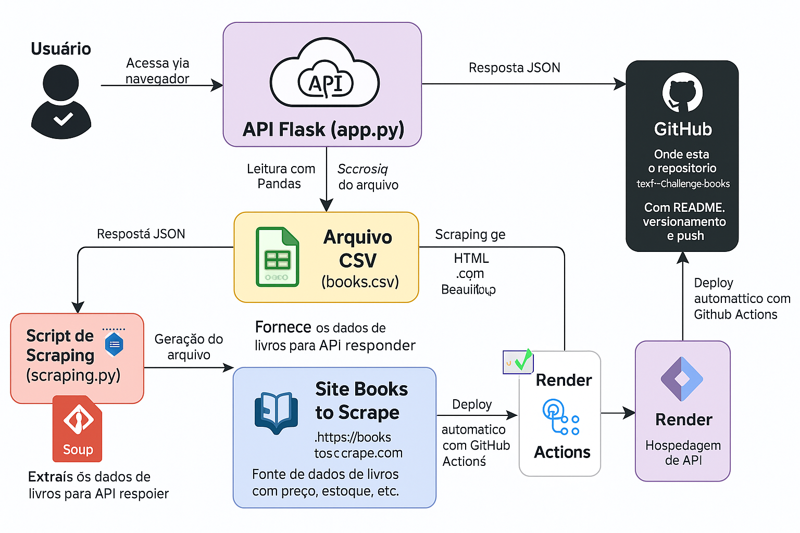

📝 README.md
markdown
Copiar
Editar
# 📚 Tech Challenge - Fase 1: Machine Learning Engineering

## 📌 Descrição do Projeto

Este projeto tem como objetivo aplicar os conhecimentos de engenharia de dados na construção de um pipeline de coleta e exposição de dados por meio de uma API REST. Os dados são extraídos automaticamente do site [Books to Scrape](https://books.toscrape.com/), salvos em um arquivo CSV e disponibilizados por meio de uma API desenvolvida com Flask.

---

## 🧪 Tecnologias Utilizadas

- Python
- Flask
- BeautifulSoup
- Pandas
- Git & GitHub
- VS Code

---

## 🛠️ Funcionalidades

✅ Web Scraping automatizado das categorias e livros  
✅ Armazenamento dos dados em `books.csv`  
✅ API RESTful com autenticação básica  
✅ Filtros de busca por título e listagem de livros e categorias  
✅ Código modular e organizado

---

## 📁 Estrutura do Projeto

tech-challenge-books/
│
├── api/
│ └── app.py # API Flask
│
├── data/
│ └── books.csv # Arquivo com os dados extraídos
│
├── scripts/
│ └── scraping.py # Script de web scraping
│
├── test_read_csv.py # Script para testar leitura do CSV
│
├── README.md
└── requirements.txt # Bibliotecas necessárias

yaml
Copiar
Editar

---

## 🧭 Arquitetura da Solução




---

## 🚀 Como Executar o Projeto Localmente

1. **Clone o repositório:**

```bash
git clone https://github.com/johnrobert-oli/tech-challenge-books.git
Crie e ative um ambiente virtual:

bash
Copiar
Editar
python -m venv venv
venv\Scripts\activate
Instale as dependências:

bash
Copiar
Editar
pip install -r requirements.txt
Execute o scraping para gerar o arquivo CSV:

bash
Copiar
Editar
python scripts/scraping.py
Inicie a API:

bash
Copiar
Editar
python api/app.py
🔍 Exemplos de Rotas
http://127.0.0.1:5000/ → Teste de conexão: “API de Livros funcionando!”

http://127.0.0.1:5000/api/v1/books/0 → Retorna o livro com índice 0

http://127.0.0.1:5000/api/v1/categories → Lista de categorias (serão preenchidas)

http://127.0.0.1:5000/api/v1/books/search?title=harry → Pesquisa por título

🧠 Autor
John Robert
GitHub: @johnrobert-oli

yaml
Copiar
Editar
