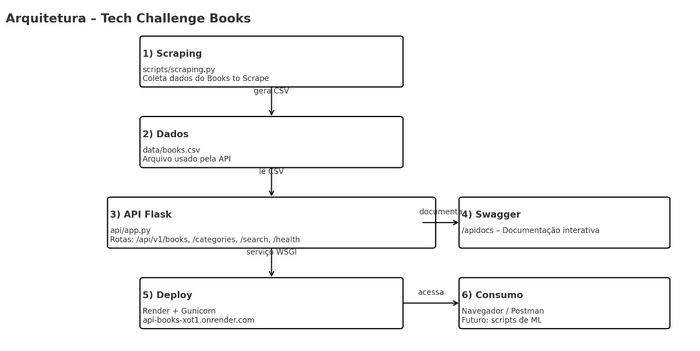

# 📚 Tech Challenge - Fase 1: Machine Learning Engineering

## 📌 Descrição do Projeto
Este projeto aplica conceitos de engenharia de dados para criar um pipeline de coleta e exposição de dados através de uma API REST.  
Os dados são extraídos automaticamente do site [Books to Scrape](https://books.toscrape.com/), salvos em um arquivo CSV e disponibilizados por uma API desenvolvida com Flask.

---

## 🧪 Tecnologias Utilizadas
- Python
- Flask
- BeautifulSoup
- Pandas
- Git & GitHub
- VS Code
- Gunicorn
- Render (deploy)

---

## 🛠️ Funcionalidades
✅ Web Scraping automatizado das categorias e livros  
✅ Armazenamento dos dados em `books.csv`  
✅ API RESTful para consulta de dados  
✅ Filtros de busca por título e listagem de livros e categorias  
✅ Deploy público na plataforma Render  

---

## 📁 Estrutura do Projeto
```
tech-challenge-books/
│
├── api/
│   └── app.py               # API Flask
│
├── data/
│   └── books.csv            # Arquivo com os dados extraídos
│
├── scripts/
│   └── scraping.py          # Script de web scraping
│
├── test_read_csv.py         # Teste de leitura do CSV
│
├── README.md
├── requirements.txt         # Bibliotecas necessárias
└── runtime.txt              # Versão do Python para deploy
```

---

## 🧭 Arquitetura da Solução


---

## 🚀 Como Executar o Projeto Localmente

1. **Clone o repositório**
```bash
git clone https://github.com/johnrobert-oli/tech-challenge-books.git
```

2. **Crie e ative um ambiente virtual**
```bash
python -m venv venv
venv\Scripts\activate   # Windows
source venv/bin/activate  # Linux/Mac
```

3. **Instale as dependências**
```bash
pip install -r requirements.txt
```

4. **Execute o scraping para gerar o arquivo CSV**
```bash
python scripts/scraping.py
```

5. **Inicie a API**
```bash
python api/app.py
```

---

## 🔗 API Online no Render
A API também está disponível publicamente no Render:  
Base URL: **https://api-books-xot1.onrender.com**

---

## 🔍 Exemplos de Rotas

| Método | Endpoint | Descrição | Exemplo |
|--------|----------|-----------|---------|
| GET | `/` | Teste de conexão | [Link](https://api-books-xot1.onrender.com/) |
| GET | `/api/v1/health` | Verifica se a API está online | [Link](https://api-books-xot1.onrender.com/api/v1/health) |
| GET | `/api/v1/books` | Lista todos os livros | [Link](https://api-books-xot1.onrender.com/api/v1/books) |
| GET | `/api/v1/books/{id}` | Retorna um livro pelo índice | [Link](https://api-books-xot1.onrender.com/api/v1/books/0) |
| GET | `/api/v1/categories` | Lista todas as categorias | [Link](https://api-books-xot1.onrender.com/api/v1/categories) |
| GET | `/api/v1/books/search?title={title}` | Busca livros por título | [Link](https://api-books-xot1.onrender.com/api/v1/books/search?title=harry) |
| GET | `/__routes` | Lista todas as rotas disponíveis (uso interno) | [Link](https://api-books-xot1.onrender.com/__routes) |

---

## 🧠 Autor
**John Robert**  
GitHub: [@johnrobert-oli](https://github.com/johnrobert-oli)
